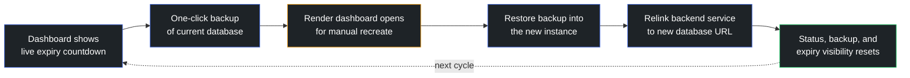
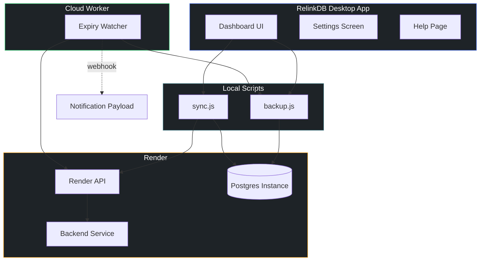
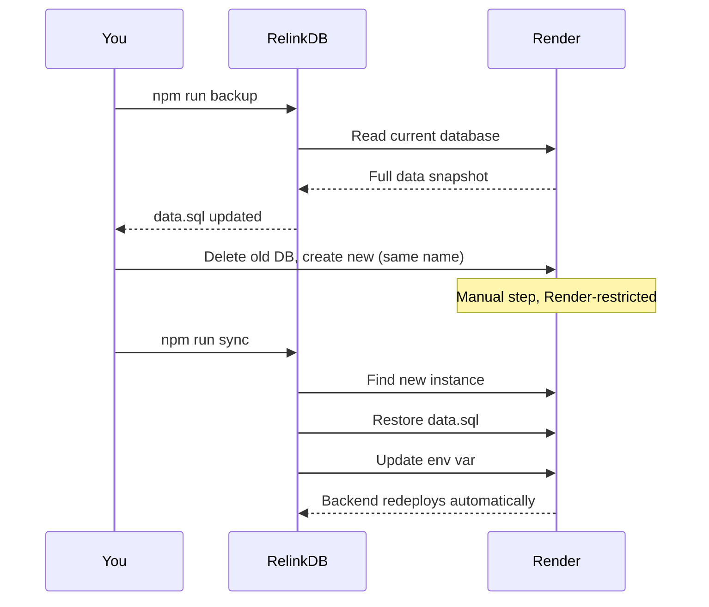

<div align="center">


<p>
  
  
  
  
</p>

<p>
  
  
  
  
</p>

**Render's free Postgres databases expire every 30 days. RelinkDB turns that monthly scramble into a two-minute, guided routine.**

[Overview](#overview) · [Screenshots](#screenshots) · [How It Works](#how-it-works) · [Features](#features) · [Setup](#setup) · [Monthly Workflow](#monthly-workflow) · [Cloud Worker](#cloud-worker) · [Architecture](#architecture)

</div>

<br />

## Overview

Render's free-tier Postgres instances are wiped on a fixed schedule. That single constraint quietly expands into a multi-step chore every operator has to repeat, remember, and get right:

| Step | Risk if missed or mistimed |
|---|---|
| Track the expiry date | Database disappears with no warning |
| Pull fresh data before deletion | Real user data is lost permanently |
| Recreate the database in Render | Backend has nothing to connect to |
| Restore the backup into the new instance | New database is empty |
| Relink the backend service to the new URL | App silently points at a dead connection |

RelinkDB does not try to eliminate the one step Render forces to stay manual — creating the new database in the dashboard. Instead, it wraps everything *around* that step into a clear, low-stress operator flow, so the monthly renewal stops being something to dread.

<br />

## Screenshots


## How It Works



Only the orange step happens outside the app — clicking **New → Postgres** in the Render dashboard, which Render restricts to manual action on the free tier. Every other step is one click inside RelinkDB.

<br />

## Features

<table>
<tr>
<td width="50%" valign="top">

**Operator Dashboard**
- Live expiry countdown for the active database
- Status, startup, backup, and expiry all visible at a glance
- Clean, focused desktop UI instead of scattered terminal commands

**Backup and Restore**
- One-click export of the current database before it disappears
- Restore step wired directly into the new instance
- Automatic relink of the backend service to the fresh database URL

</td>
<td width="50%" valign="top">

**Built for Real Use**
- Local settings screen for Render credentials and workflow config
- Launch-on-login support on Windows
- Portable app launch path — feels like a real desktop app, not a dev command
- Built-in help page with setup and monthly-use instructions

**Reliability**
- Falls back to a pure-JS dump/restore path when Postgres client tools aren't installed
- Prints raw connection-info JSON when Render's response shape shifts, so nothing fails silently

</td>
</tr>
</table>

<br />

## Architecture


<br/>


## Monthly Workflow

Run this a few days **before** expiration, not after. Pull data from the old database while it is still alive, then delete it.



**1. Pull fresh data — about 10 to 30 seconds**
```bash
npm run backup
```
Connects to the still-running database and overwrites `data.sql` with everything currently in it, including live user data.

**2. Recreate the database — manual, about 30 to 45 seconds**
Delete the now-backed-up database in the Render dashboard, click **New → Postgres**, reuse the same name as `RENDER_DB_NAME`, choose **Free**, click **Create**. No need to copy any credentials.

**3. Restore and relink — about 10 to 20 seconds**
```bash
npm run sync
```
Finds the new instance, restores the backup from step one, and updates the backend's env var, which triggers an automatic redeploy.

Total hands-on time: roughly two minutes, with only one of those spent clicking through the Render dashboard.

> **Timing note:** Free databases get a 14-day grace period before actual deletion — they simply become inaccessible while expired. Act before the 30-day mark so the backup pulls from a database that is still answering queries.

<br />

## Cloud Worker

The desktop app stays focused on the operator flow; a small standalone worker handles the watching:

```bash
npm run cloud:expiry
```

The worker reads `RENDER_API_KEY`, `RENDER_DB_NAME` and `BACKUP_FILE`, plus the optional `RELINKDB_*` variables — all listed in the [Environment Variables Reference](#environment-variables-reference).

**What it does:**
- Checks the active database's age on a schedule
- Detects when it enters the warning window
- Auto-exports a backup once per database cycle
- Emits a renewal-ready notification payload, optionally to a webhook

**How to confirm it is working:** run the worker and watch the console. It logs the current status as either `DB has X day(s) left`, or `exporting backup now` once the warning window opens — followed by the notification payload or webhook result. The desktop app then shows the renewal banner and updated backup state on its next refresh.

<br />

## Portable Windows Launch

For a one-click launcher from the project folder:

```bash
Start RelinkDB.cmd
```

To stage a full portable build with a bundled Electron runtime:

```bash
npm run package:portable      # builds dist/portable/
npm run desktop:shortcut      # adds a Desktop shortcut
npm run launch:portable       # launches the staged .exe
```

`npm start` remains the standard development path.

<br />


**Why the free tier still works:** Render blocks provisioning new infrastructure via the API on the free tier — creating a database or service stays manual. Reading an existing database's connection info and updating an existing service's env vars, however, are unrestricted on any plan. RelinkDB chains those two unrestricted operations together with local dump and restore steps, leaving only the "New Postgres" click as a manual action.

<br />

## Setup

```bash
npm install
cp .env.example .env
```

Then fill in `.env` using the reference below.

### Environment Variables Reference

Every variable RelinkDB reads, what it controls, and what happens when it is left unset. A value in the **Default** column is applied automatically, so the variable can be omitted from `.env` entirely.

**Desktop app and local scripts** — used by `npm start`, `npm run backup` and `npm run sync`

| Variable | Required | Default | Description | Example |
|---|---|---|---|---|
| `RENDER_API_KEY` | Yes | — | Authenticates every Render API call. Create one under Account Settings → API Keys → Create API Key. | `rnd_xxxxxxxxxxxxxxxxxxxxxxxxxxxx` |
| `RENDER_DB_NAME` | Yes | — | The exact Postgres instance name. Reuse the same name every time the database is recreated so RelinkDB can always find the current one. | `myapp-db` |
| `RENDER_WEB_SERVICE_ID` | Yes, for `sync` | — | The backend Web Service to relink, taken from the `srv-...` segment of the service's dashboard URL. Not needed for backups. | `srv-xxxxxxxxxxxxxxxxxxxx` |
| `RENDER_ENV_VAR_KEY` | No | `DATABASE_URL` | The env var on the backend service that receives the new connection string. Change this only if your app reads the database URL from a different key. | `POSTGRES_URL` |
| `BACKUP_FILE` | No | `./data.sql` | Dump file written by `backup` and read back by `sync`. Overwritten on every backup, so keep it out of version control if it holds real user data. | `./backups/data.sql` |

**Cloud expiry worker only** — used by `npm run cloud:expiry`

| Variable | Required | Default | Description | Example |
|---|---|---|---|---|
| `RELINKDB_NOTIFY_WEBHOOK` | No | none — the payload is logged to the console instead | Receives the `renewal-ready` JSON payload as an HTTP `POST`. A non-2xx response is treated as a failure and raised as an error. | `https://hooks.example.com/relinkdb` |
| `RELINKDB_NOTIFICATION_EMAIL` | No | `null` | Included in the payload as `notificationEmail` so each operator can route their own alerts. The worker itself never sends email. | `you@example.com` |
| `RELINKDB_CHECK_MS` | No | `86400000` (24 hours) | Interval between expiry checks in loop mode. Ignored when the worker is invoked with the `once` argument. | `3600000` |
| `RELINKDB_STATE_FILE` | No | `cloud/expiry-worker-state.json` | Where the worker records the last auto-export and notification. This is what stops it from exporting the same database cycle twice, so point it at a persistent path when running on ephemeral infrastructure. | `/var/lib/relinkdb/state.json` |

> **Notes**
> - The worker also needs `RENDER_API_KEY` and `RENDER_DB_NAME`, and exits with `Missing RENDER_API_KEY or RENDER_DB_NAME.` if either is absent.
> - The worker resolves the `BACKUP_FILE` default against the current working directory, while `backup` and `sync` resolve it relative to the project root. Set an absolute path if you run the worker from another directory.

For full-fidelity dumps (foreign keys, indexes, sequences, custom types), install the Postgres client tools once:

```bash
# macOS
brew install libpq && brew link --force libpq

# Ubuntu / Debian
sudo apt-get install postgresql-client

# Windows
# Install the client-only option from postgresql.org/download/windows
# or run: scoop install postgresql
```

Without the client tools, both scripts fall back to a pure-JS path using the `pg` library — fully functional for simple schemas, with no extra installs required.

<br />


<div align="center">

---

Built to turn a monthly maintenance chore into a two-minute routine.

</div>
